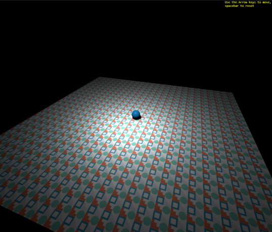

# Workshop Programming
## Context
* This project contains the starting code and the 'finished' code of the Workshop Programming.
* We will build a small 3D world with some interaction.
* This is not meant to be a best-practices example. Some corners are cut ...
  * no rights to install software
  * no access to a local or online server
  * no pre-installed IDE
  * the participants have varying and unknown prior IT knowledge and experience

Still, I hope you'll enjoy this Workshop!

## The Results

A plane, a Light and a Ball that can be steered with the arrow keys

## Getting started
* Download the source code as a zip file
* Extract the zip file on the computer and remember where!
* Surf to https://vscode.dev, choose 'Open Folder' and select the folder where you extracted the zip-file
* Test the project by opening the file ```index.html``` in your browser
* Refresh the page each time you changed your code and want to see the changes
* Tip: open the browser DEV-tools (```F12```)